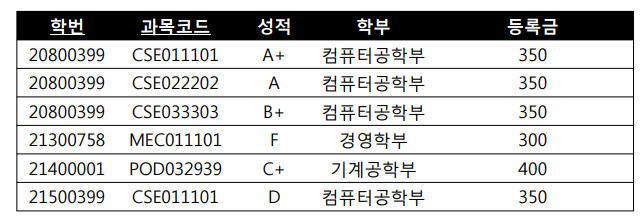
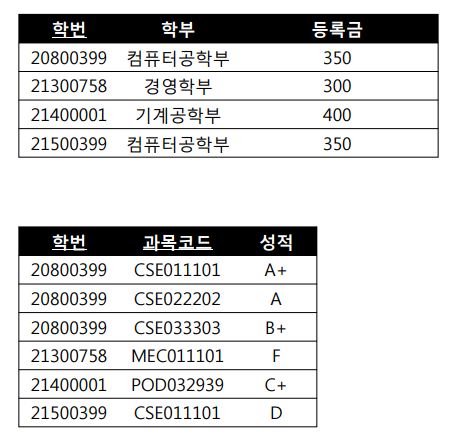
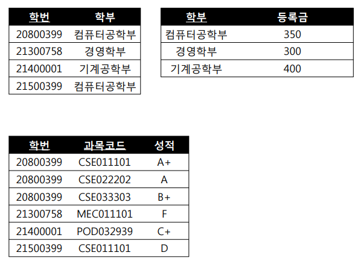

# DB 정규화란?
한 릴레이션에서 여러 엔티티의 애트리뷰트들을 혼합하게 되면 정보가 중복 저장되고 저장 공간을 낭비하게 된다.  
이럴 때 이상 문제들이 생긴다고 하는데, 이러한 문제들을 해결하기 위해서 정규화가 나왔다.  

## 정규화란  
이상 문제를 해결하기 위해 속성들끼리의 종속 관계를 여러 개의 릴레이션으로 분해하는 과정이다.

## 이상 문제

- **삽입 이상**  
    데이터 저장 시 원하지 않는 정보가 함께 삽입

- **삭제 이상**  
    튜플을 삭제함으로써 유지되어야 하는 정보까지도 연쇄적으로 삭제

- **갱신 이상**  
    중복된 튜플 중 일부의 속성만 갱신시킴으로써 정보의 모순성 발생

이런 이상 문제를 해결하기 위해 나온게 정규화이다.  
이상 문제가 있다는 것은 엔티티를 구성하고 있는 애트리뷰트 간에 **함수적 종속성**으로 판단한다.

판단된 함수적 종속성은 좋은 릴레이션 설계의 정형적 기준으로 사용된다.  
어떠한 함수 종속성을 만족하는지에 따라 정규형 정의되고, 정규형을 만족하지 못하는 정규형을 나쁜 릴레이션으로 파악한다.

### 함수적 종속성

어떠한 릴레이션에서 속성들의 부분 집합을 X, Y라 할 때 특정 튜플에서 X 값이 Y의 값을 결정한다면 Y가 X에 함수적으로 종속되었다고 한다.

## 정규화 과정

### 제 1 정규형
도메인은 모두 원자값이어야 한다.  
모든 속성은 반드시 하나의 값을 가져야 한다.

### 제 2 정규형
완전 함수적 종속 (부분 함수 종속을 제거)

**부분 함수적 종속**  
속성 Y가 속성 X의 전체가 아닌 일부분에도 함수적으로 종속됨

**완전 함수적 종속**  
속성 Y가 속성 X 전체에 대해서만 함수적으로 종속된 경우

**ex**  

위의 표에서 학부와 등록금은 **학번**만 알아도 되고, 성적은 **학번 + 과목코드**로 결정할 수 있습니다.

이에 따라 아래의 표처럼 릴레이션을 분리시킵니다.

### 제 3 정규형
이행 함수 종속 제거

**이행 함수 종속이란?**  
A값을 알 때 B값을 알 수 있고, B값을 알 때 C값을 알 수 있으면 이행 함수 종속이다.

**ex**  

이행 함수 종속으로 A → B, B → C 일 때 A → C 가 되어야 한다고 한다.

위의 표를 예시로 들면 학번으로 등록금을 결정할 수 있어야 한다.   
학부가 같은 컴퓨터공학부의 등록금이 변경되었는데, 학번에 따라 다 변경하지 못한다면 갱신이상이 일어난다. 

이러한 점을 수정하기 위에 아래처럼 릴레이션을 분리한다.

> 비공식적으로는 3NF(제 3 정규형)이 되었으면 정규화 되었다고 말한다.

### BCNF 
모든 결정자가 후보키인 경우
- 결정자이면서 후보키가 아닌 것은 제거

### 제 4 정규형
다치 종속 제거

**다치 종속이란?**  
두 속성이 1 : 다 대응이 되는 경우

### 제 5 정규형
조인 종속성은 후보키를 통해서만 성립된다.

**조인 종속성이란?**  
테이블을 분해한 결과를 join에 의해서 다시 원상복구 시킬 수 있는지

## 정규화의 장점
- 이상 현상 문제점 해결 가능
- DB 변경시 구조를 변경하지 않아도 되거나 일부만 변경하면 된다.

## 단점
- 릴레이션 분해로 인해 JOIN이 많아진다.
- JOIN이 많아짐으로 인해 응답 시간이 느려질 수 있다.

# 반정규화 / 역정규화(De-normaliization)
이러한 단점으로 인해 나온 개념이 반정규화이다.

## 반정규화 / 역정규화
정규화된 엔티티, 속성, 관계를 시스템의 성능 향상 및 개발과 운영의 단순화를 위해 중복 통합, 부닐 등을 수행하는 데이터 모델링 기법  
일반적으로 조회에 대한 처리 성능이 중요하다고 판단될 때 부분적으로 반정규화를 고려하게 된다.

### 사용 대상
- 자주 사용되는 테이블에 엑세스하는 프로세스 수가 많고 항상 일정한 범위만을 조회하는 경우
- 대량 데이터가 있고, 그 범위를 자주 처리하고 성능 상 이슈가 있을 경우
- JOIN을 지나치게 많이 사용해 데이터 조회하는 것이 기술적으로 어려울 경우

## 중복 테이블
반정규화의 한 방법으로 테이블에 대한 칼럼의 중복을 허용하는 것이다.

### 중복 테이블 유형
**집계(통계) 테이블**  
SUM, AVG 등 집계 데이터를 위한 테이블   
원본 테이블에 트리거 설정한다.

**진행 테이블**  
검색 조건이 여러 테이블에 걸쳐 다양하게 사용되며 복잡하고 처리량이 많은 경우에 사용 

> 반정규화를 너무 과도하게 사용하면 데이터 무결성이 깨질 수 있고, 응답 시간이 늦어질 수 있으니 적절히 사용하자

## 참고
[[DB 이론] 데이터베이스 정규화란? (이상 문제, 함수적 종속, 정규화 과정)](https://nirsa.tistory.com/107)  
[데이터베이스 정규화 - 이상현상 & 함수적 종속성](https://yaboong.github.io/database/2018/03/09/database-anomaly-and-functional-dependency/)  
[데이터베이스 정규화 - 1NF, 2NF, 3NF](https://yaboong.github.io/database/2018/03/09/database-normalization-1/)  
[데이터베이스 정규화 - BCNF](https://yaboong.github.io/database/2018/03/10/database-normalization-2/)  
[11. 데이터베이스 정규화(Normalization), 역정규화(DeNormalization)](https://dodo000.tistory.com/21)  
[[데이터 모델링] 반정규화, 중복 테이블](https://neokido.tistory.com/entry/%EB%8D%B0%EC%9D%B4%ED%84%B0-%EB%AA%A8%EB%8D%B8%EB%A7%81-%EB%B0%98%EC%A0%95%EA%B7%9C%ED%99%94-%EC%A4%91%EB%B3%B5-%ED%85%8C%EC%9D%B4%EB%B8%94)
