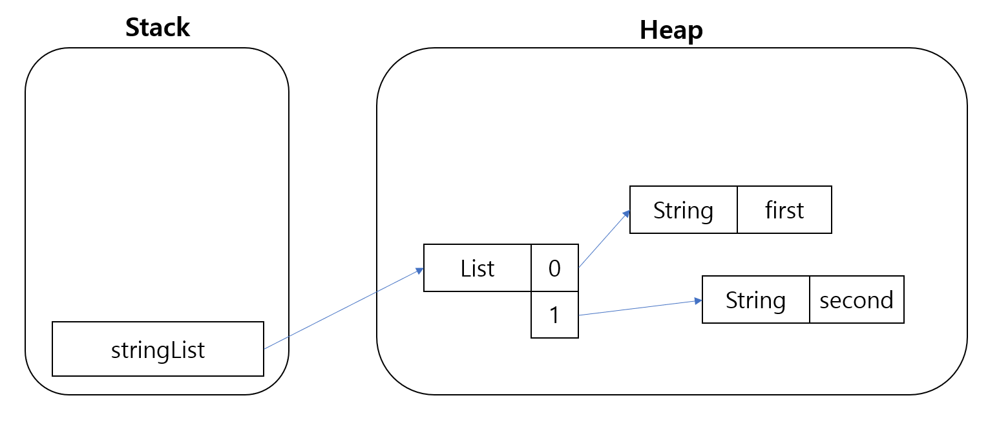
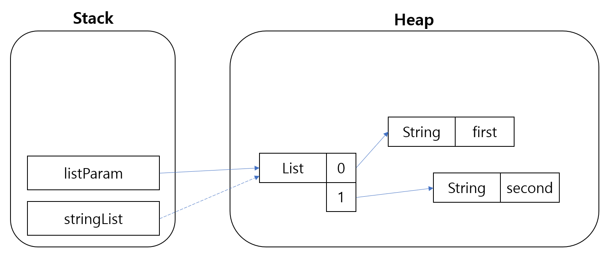
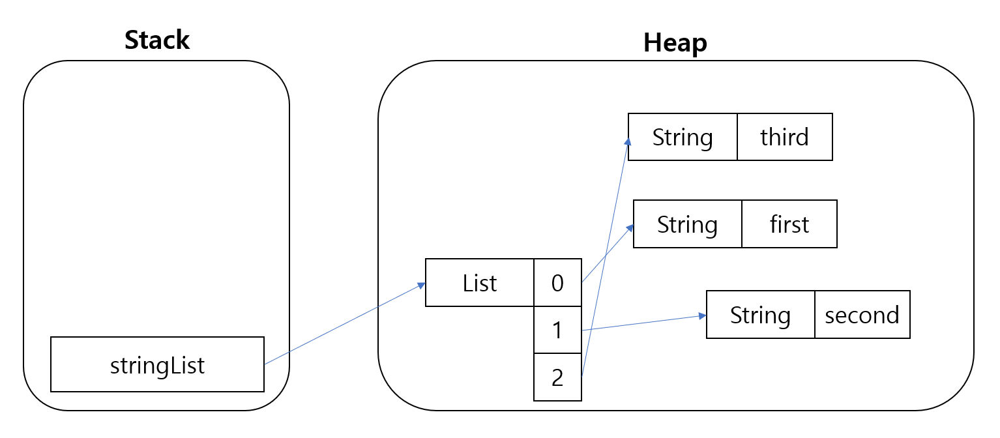

# Java의 Stack 과 Heap

Java의 메모리 영역 중 Stack과 Heap 영역이 어떻게 작동하는지 정리

## Stack

- Heap 영역에 생성된 Object 타입의 데이터의 참조값이 할당
- 원시 타입의 데이터가 값과 함께 할당  
원시 타입 - int, byte, shotre, log ....   
참조값이 아니라 실제 값 stack에 저장
- 지역 변수들은 scope에 따른 visibility를 가짐  
javascript 공부할 당시 배웠던 scope!
- 각 Thread는 자신만의 Stack 을 가짐  
    Thread 하나가 새롭게 생성되는 순간 해당 Thread를 위한 Stack도 함께 생성  
    각 쓰레드에서 다른 쓰레드의 stack 영역에는 접근 안된다  
    오늘 본 thread에서 heap, data, code 영역은 한 프로세스 내에서 공유하고 있다는 것 같이 기억!

**예시**

```java
public class StackEx() {

    private static int changeParam(int param) {
        int temp = param * 2;
        int result = temp / 3;
        return result;
    }

    public static void main(String...args) { 
        int mainParam = 6;
        mainParam = changeParam(mainParam);
    }

}
```

1. 스택에 mainParam = 6 담긴다
2. changeParam 함수를 통한 param, temp, result 가 차례대로 계산하면서 담긴다
3. 그 후 mainParam 이 계산된 4로 재할당
4. changeParam에 있었던 변수들은 함수 호출 종류시 지역변수 scope 이기 때문에 stack에서 pop된다
5. 결국 main 함수 종료되면 mainParam도 pop되면서 프로그램 종료

## Heap

- 주로 긴 생명주기 가지는 데이터들 저장
- 모든 Object 타입(Integer, String, ArrayList...) 생성
- 쓰레드와 상관없이 단 1개의 heap 영역 존재 (프로세스 당)
- Heap 영역에 있는 오브젝트들을 가리키는 레퍼런스 변수가 stack에 올라감
- 최대 heap ㅋ크기는 미리 정의되어 있지 않으며 실행 중인 시스템에 따라 다름 → 명시적으로 크기 지정할 수 있음
- new 키워드는 heap에 충분한 여유 공간이 있는지 확인하고 메모리에 개체를 만들고 스택에 참조를 한다.

**예시**

```java
import java.util.ArrayList;
import java.util.List;

public class HeapEx {

    public static void main (String...args) { 
        List<String> stringList = new ArrayList<>();
        stringList.add("first");
        stringList.add("second");
        
        change(stringList);
    }
    
    private static void change(List<String> listParam) {
        String value = listParam.get(0);
        listParam.add("third");
    }

}
```

1. Heap에 빈 곳 있는지 확인 후 빈 list 생성 후 빈 list 참조하는 stringlist 로컬변수를 스택에 할당
2. list add 할 때마다 list 내부 인덱스에 데이터에 대한 레퍼런스 값을 갖는다

    

3. change 함수 호출을 하면 stringList 변수 넘겨줄 때 파라미터 값이 그대로 복사

    
    
4. 참조 변수가 새롭게 할당되어 기존 list를 참조하기 때문에 add 시 Heap에 있는 동일한 List 에 추가됨
5. change 함수가 끝나면 stack에 있는 변수들은 다 사라지고, 위의 사진처럼 stringList 변수만 남되, Heap 상의 List는 change 함수에서 추가된 third를 같이 가지고 있음

    
    
### Immutable Object 불변객체

Immutable Object는 불변객체로 값이 변하지 않는다.  
변경하는 연산이 수행되면 새로운 객체가 할당된다.


**예시**  
String, Wrapper class(Integer, Character, Byte, Boolean, Long, Double, Float, Short)   
새로운 객체가 할당되기 때문에 위에서 말한 예제와 다른 값이 나오게 된다.

### 불변객체의 heap 구조

```java
public class HeapImmutableEx {
    public static void main (String...args) {
        Integer num = 10;
        changeInteger(num);

        String word = "hi";
        changeString(word);
    }

    public static void changeInteger(Integer param) {
        param += 10;
    }

    public static void changeString(String param) {
        param += "hello";
    }
}
```

Integer와 String 모두 불변 객체이기 때문에 change 함수를 거친 후에도 각각 변하지 않고  
그대로 10과 hi가 있는 것을 알 수 있다.

Integer로만 확인해봤을 때

1. heap 에 10을 저장하고 stack에 num이 레퍼런스 값을 갖는다.
2. changeInteger 함수가 시작되면서 num 변수가 레퍼런스하는 10 을 param에 복사한다.
3. changInteger 함수의 scope 안에서 param은 10 + 10 연산을 실행하여 20으로 새로 저장된다.
4. changeIntger 함수가 종료되면 param이 pop 되므로 num을 출력하면 계산되어 param에 저장된 20이 아닌 원래 num의 값인 10이 그대로 출력된다.

이렇게 되는 것은 Garbage Collection 과 연관이 있으니 이후는 gc에 관한 것을 공부하자!

### 참조
[자바 메모리 관리 - 스택 & 힙](https://yaboong.github.io/java/2018/05/26/java-memory-management/)  
[Java Memory Management - DZone Java](https://dzone.com/articles/java-memory-management)
