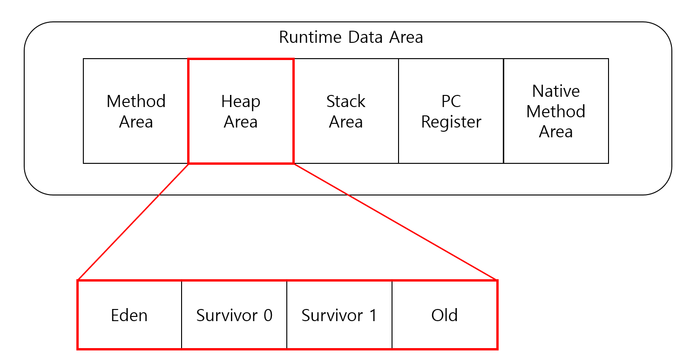

# JVM

자바 가상 머신(Java Virtual Machine)으로 java 프로그램의 모든 것들을 실행시키는 역할
- 스택 기반의 가상 머신

### JVM 공부해야하는 이유

한정된 메모리를 효율적으로 사용해서 최고의 성능을 내기 위해서..  
JVM 작동원리를 이해해야 트랜잭션에 대한 응답시간 또는 처리량을 염두해두고 코딩할 수 있기 때문이다.

### 역할
- 메모리 관리(Garbage Collection)
- 자바 애플리케이션을 클래스 로더를 통해 읽어 들여 자바 API와 함께 실행
- Java가 OS에 구애받지 않고 재사용 가능하게 해줌

## Java 프로그램 실행 과정

1. 프로그램 실행 시 JVM은 OS로 부터 해당 프로그램이 필요로 하는 메모리 할당 받음
(영역으로 나눠서 관리)
2. 컴파일러가(javac) 자바 소스코드(.java)를 읽어들여 자바 바이트코드(.class)로 변환
3. class loader 를 통해 class 파일들 JVM으로 로딩
4. 로딩된 class 파일들 Execution engine을 통해 해석
5. 해석된 바이트코드는 Runtime Data Areas에 배치되어 실질적인 수행이 이뤄짐

실행과정 중 필요하다면 Thread Synchronization(쓰레드 동기화)나 GC 같은 관리작업 수행

## JVM 구조

### Class Loader(클래스 로더)

JVM내로 클래스(.class 파일)를 로드하고 링크를 통해 배치하는 작업을 수행하는 모듈이다.  
런타임 시에 동적 로드 하며, 일반적으로 클래스들은 요청 시 한 차례만 로드된다.

### Execution Engine(실행 엔진)
클래스 로더를 통해 로딩된 클래스들의 바이트 코드를 해석한다.  
이 때 2가지 방식을 사용하게 된다.

**자바 바이트 코드**  
Java compiler에 의해 수행된 결과물(.class 파일)  
사람이 보기 편한 형태로 기술 된 것

1. Interpreter(인터프리터)  
    자바 바이트 코드를 명령어 단위로 읽어서 실행  
    하나하나 해석은 빠르지만 실행은 느리다.

2. JIT(Just In Time)  
    인터프리터 방식으로 실행하다가 적절한 시점에 바이트 코드 전체를 컴파일 해서 네이티브 코드로 변경 후 실행  
    네이티브 코드는 캐시에 보관하므로 빠르게 수행 된다.  
    컴파일 하는 과정이 오래걸리기 때문에 JVM은 내부적으로 해당 메서드가 얼마나 자주 수행되는지 체크한 후 일정 정도를 넘을 때만 컴파일을 진행한다.

### Runtime Data Areas

 
JVM이라는 프로그램이 운영체제 위에서 실행되면서 할당받는 메모리 영역

이 영역은 5개로 나뉜다.

1. PC Register  
    쓰레드 시작될 때 생성되며 쓰레드마다 하나씩 존재한다.   
    현재 수행 중인 JVM 명령의 주소를 갖는다.

2. JVM 스택 영역  
    프로그램 실행 과정에서 임시로 할당하고 메소드 빠져나가면 바로 소멸되는 데이터 저장하기 위한 영역  
 
3. Native Method Stack  
    다른 언어의 메소드 호출을 위해 할당되는 구역으로 언어에 맞게 stack이 형성된다.  
    자바 프로그램이 컴파일 되어 생성되는 바이트 코드가 아닌 실제 실행할 수 있는 기계어로 작성된 프로그램을 실행시키는 영역이다.

4. Method Area  
    모든 쓰레드가 공유하는 영역으로 JVM 시작될 때 생성된다.   
    클래스 정보를 처음 메모리 공간에 올릴 때 초기화되는 대상을 저장하기 위한 메모리 공간으로, 클래스와 인터페이스에 대한 런타임 상수 풀, 필드와 메서드 정보, static 변수, 메서드의 바이트코드 등을 보관한다.  
    → static 상수는 heap 영역으로 이동됐다.(Java8부터)

5. Heap Area
    모든 쓰레드가 공유하는 영역으로 JVM 시작될 때 생성된다. (GC 대상이 되는 공간)  
    객체를 저장하는 가상 메모리 공간이다.  
    클래스 영역에 올라온 클래스들만 객체로 생성할 수 있다.   

### Heap area  
힙 영역은 4개로 나뉜다.(Eden, survivor 1, survivor 2)  
GC를 담당하는 부분은 따로 공부해서 작성할 것이다. GC를 작성할 때 Heap area의 영역도 자세히 작성해보는 걸로 해야겠다.

## 참고

[#자바가상머신, JVM(Java Virtual Machine)이란 무엇인가?](https://asfirstalways.tistory.com/158)  
[[JAVA/JVM] 메모리 구조 (부제 : 성능개선을 위한 GC의 활용)](https://stophyun.tistory.com/37)  
[JVM Architecture](https://story.stevenlab.io/14)  
[Java](https://wjdqhrlf.medium.com/java-9046a241abbe)
