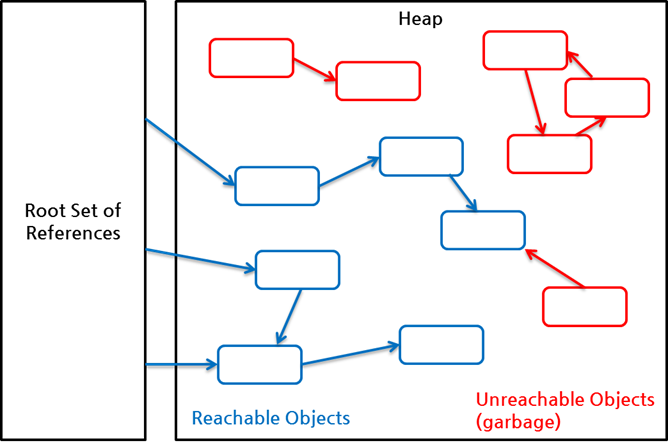

# Garbage Collection

## GC 작업
1. heap내의 객체 중에서 garbage를 찾아낸다.
2. 찾아낸 garbage를 처리해서 힙의 메모리를 회수한다.

### Garbage
Heap 영역의 오브젝트 중 stack에서 도달 불가능한(Unreachable) 오브젝트들

### Reachable 과 Unreachable
heap 에 있는 객체들은 보통 4가지 중 하나이다.

- heap 내의 다른 객체에 의한 참조
- Java 스택(Java 메서드 실행 시에 사용하는 지역변수와 파라미터들)에 의한 참조
- 네이티브 스택(JNI - Java Native Interface)에 의해 생성된 객체에 대한 참조
- 메서드 영역의 정적 변수에 의한 참조

첫 번째의 다른 객체에 의한 참조를 제외하고 나머지 3개(Java 스택, 네이티브 스택, 메서드 영역)가 root set이 되어 reachable인지 아닌지를 판가름 한다.

출처 - [NAVER D2](https://d2.naver.com/helloworld/329631)

**Reachable 객체**
root set으로부터 시작한 참조 사슬에 속한 객체들

**Unreachable 객체**
참조 사슬과 무관한 나머지 객체들  
Reachable 객체를 참조하더라도 다른 reachable 객체가 이 객체를 참조하지 않는 것도 포함

이와 관련해서 아래 글이 정리가 잘 되어있다.  
2번 읽어봤는데 아직 헷갈리기도 해서 좀 더 읽어보고 나중에 더 정리해봐야겠다.

[NAVER D2](https://d2.naver.com/helloworld/329631)

GC를 제대로 공부하기 전 알아야 할 내용

### Stop the world
GC를 실행하기 위해 JVM이 애플리케이션 실행을 멈추는 것

**대개의 경우 GC 튜닝이란**   
stop the world 시간 줄이는 것

### System.gc()
명시적으로 gc가 일어나도록 코드를 삽입하는 경우

> 모든 쓰레드가 중단되기 때문에 사용하는 것을 권장하지 않는다.

Java에서는 개발자가 코드로 메모리를 해제하지 않기 때문에 GC가 객체를 찾아 지우는 작업을 한다.

## GC의 가설
= Weak generational hypothesis

- 대부분의 객체는 금방 접근 불가능 상태(Unreachable)이 된다.
- old 객체에서 young 객체로의 참조는 아주 적게 존재한다.

이 2가지 가설의 장점을 살리기 위해 Hotspot JVM에서 2개로 물리적 공간을 나눴다.

- Young Generation 영역  
    새롭게 생성한 객체의 대부분이 위치하는 곳  
    금방 접근 불가능 상태가 되며 이 영역이 가득차면 Minor GC 발생
    
    - Eden 영역
    - Survivor 영역 2개

- Old Generation 영역  
    Young 영역에서 GC 후 살아남은 객체가 담기는 곳  
    Young 영역보다 크며 크기가 크므로 Young보다는 GC가 적게 발생  
    이 영역이 가득차서 객체가 사라질 때 Major GC(Full GC) 발생  

## GC 순서

1. 객체가 생성되면 Eden 공간에 할당
2. Eden이 가득차면 GC가 발생 (Minor GC)
3. Eden 공간에서 객체 살아있는 것 Survivor 0 으로 이동
4. 2번째로 Eden 공간에서 GC가 실행되면 남아있는 객체를 Survivor 1 로 이동
5. 객체가 X번(JVM 구현에 따라 다름) GC동안 살아남은 경우 영원히 살아남을 가능성이 가장 높으며 Old 영역으로 이동
6. Old 영역의 메모리도 충분하지 않을 시 해당 영역도 GC 발생 (Major GC / Full GC)

> Survivor 영역 중 하나는 반드시 비어있어야 한다

### Major GC(Full GC)

1. Old 영역에 있는 모든 객체들을 검사하며 참조되고 있는지 확인
2. 참조되지 않은 객체들 한 번에 제거

Minor GC보다 시간도 훨씬 많이 걸리고 실행 중에 GC를 제외한 모든 쓰레드 중지

**중지하는 이유는?**  
Old 영역에 있는 참조 없는 객체들 표시하고 지우는 동안 Heap 메모리 영역에 빈 메모리 공간이 생기게 된다. 

이 부분을 없애기 위해 재구성을 하기 때문에 다른 쓰레드가 메모리 차지하면서 꼬이지 않게 하기 위해 모든 쓰레드가 중지되는 것

## GC 옵션

-Xmx1024m : 힙 영역의 최대 사이즈를 1024MB로 설정  
-Xms512m : 초기 힙 영역의 크기를 512MB로 설정  
-Xmn256m : young 영역의 크기 256MB로 설정  
XX:+UseSerialGC  
XX:+UseParallelGC  
XX:+UseConcMarkSweepGC

등등

옵션에 관한 자세한 얘기는 좀 더 GC에 대해서 알게 되었을 때 공부해야겠다.   
지금은 이해 할 듯 말 듯.. 뭔가 좀 헷갈리고 잘 머릿속에 안들어와서 일단 뭐가 있는지만 알아두자

[NAVER D2](https://d2.naver.com/helloworld/329631)  
[NAVER D2](https://d2.naver.com/helloworld/1329)  
[Java Memory Management - DZone Java](https://dzone.com/articles/java-memory-management)  
[[JVM Internal] JVM 메모리 구조](https://12bme.tistory.com/382)  
[Java](https://wjdqhrlf.medium.com/java-9046a241abbe)  
[자바 메모리 관리 - 가비지 컬렉션](https://yaboong.github.io/java/2018/06/09/java-garbage-collection/)
